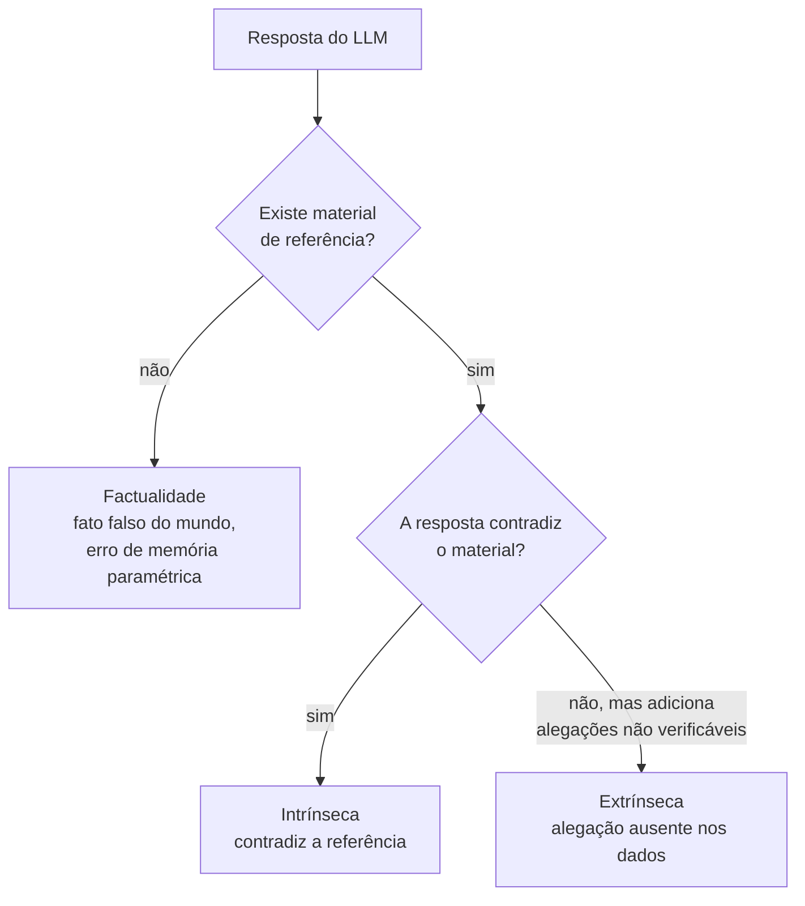
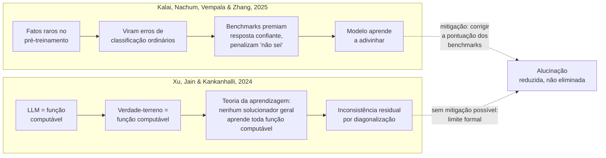
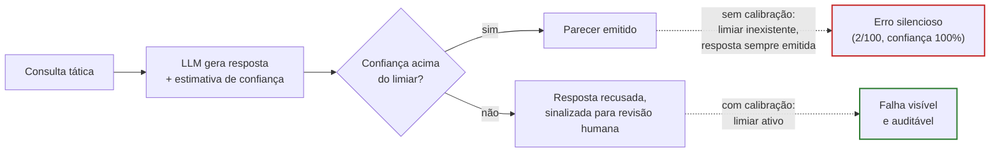

# 01 · Conceitos fundamentais

## O que é alucinação em LLMs?

A base conceitual antes de qualquer discussão de risco ou mitigação: o que conta como alucinação, e por que "confiável" não é o mesmo que "digno de confiança".

## Definição canônica

!!! info "Ji et al., ACM Computing Surveys, 2023"
    Conteúdo gerado que é sem sentido, infiel ou factualmente incorreto em relação ao contexto de origem ou à verdade do mundo real.

    [DOI: 10.1145/3571730](https://doi.org/10.1145/3571730)

## Taxonomia estrutural

=== "Intrínseca"
    A resposta contradiz diretamente o material de referência.

    Ex.: inversão de coordenadas de radar do SISFRON.

=== "Extrínseca"
    A resposta introduz alegações inverificáveis, ausentes nos dados.

    Ex.: fabricar números de série de mísseis.

=== "Factualidade"
    Geração confiante de fatos falsos sobre o mundo, por erro de memória paramétrica.

## Por que os LLMs alucinam

Duas linhas de argumento, independentes entre si, tratam a alucinação como algo além de um defeito de engenharia corrigível por mais dados ou mais parâmetros.

=== "Origem estatística e de incentivo"
    [Kalai, Nachum, Vempala & Zhang (2025)](https://doi.org/10.48550/ARXIV.2509.04664) mostram que o pré-treinamento converte fatos raros em erros de classificação ordinários, indistinguíveis estatisticamente de exemplos corretos. A persistência do problema após o pré-treinamento vem de um segundo mecanismo: os protocolos de avaliação e os benchmarks usuais recompensam a resposta confiante e penalizam "não sei", o que empurra o modelo para adivinhar em vez de abster-se. A correção proposta pelos autores é sócio-técnica, mudar a pontuação dos benchmarks, não puramente arquitetural.

=== "Limite formal de aprendizagem"
    [Xu, Jain & Kankanhalli (2024)](https://doi.org/10.48550/ARXIV.2401.11817) formalizam a alucinação como inconsistência entre um LLM computável e uma função de verdade-terreno computável, e invocam resultados de teoria da aprendizagem: nenhum LLM usado como solucionador geral de problemas pode aprender todas as funções computáveis. A conclusão é que a alucinação é inevitável tanto no mundo formal quanto no mundo real, por um argumento de diagonalização, não por um argumento estatístico.

!!! warning "Duas teses distintas, não uma só"
    O argumento de Kalai et al. é sobre incentivo de treino e avaliação; o de Xu et al. é sobre limite de computabilidade. Não são versões da mesma ideia: um aponta para a correção de benchmarks como mitigação viável, o outro implica que nenhuma correção de benchmark elimina o problema por completo.

## Calibração e incerteza epistêmica

O vocabulário de "calibração" e "entropia semântica", usado nos capítulos [03](03-deteccao-mitigacao.md) e [04](04-benchmarks.md), tem origem em três resultados específicos.

[Kuhn, Gal & Farquhar (ICLR 2023)](https://arxiv.org/abs/2302.09664) introduzem a **entropia semântica**: em vez de medir incerteza sobre a superfície textual de uma resposta, o método agrupa gerações por equivalência de significado e calcula entropia sobre essas classes de sentido. Duas frases com palavras diferentes mas o mesmo significado contam como uma única classe, o que evita que paráfrase inflate artificialmente a incerteza medida.

[Farquhar, Kossen, Kuhn & Gal (Nature, 2024)](https://doi.org/10.1038/S41586-024-07421-0) operacionalizam a entropia semântica como detector de **confabulações**, um subtipo específico de alucinação (geração arbitrária e incorreta, não todo o espaço de alucinações), em modo black-box e sem necessidade de dados específicos de tarefa, validado através de múltiplos domínios.

!!! danger "Calibração não é suficiente sozinha: o motivo é formal, não só empírico"
    [Kalai & Vempala (STOC 2024)](https://doi.org/10.1145/3618260.3649777) provam que todo modelo generativo bem calibrado apresenta uma taxa de alucinação mínima, decorrente de uma cota estatística tipo Good-Turing, para fatos arbitrários e pouco frequentes no treino. O resultado não se aplica a fatos que se repetem com frequência ou seguem um padrão sistemático, como aritmética. Isso reforça, com prova formal, a mesma conclusão qualitativa da seção anterior: [alta acurácia sem calibração de incerteza é um risco silencioso](#robusto-vs-confiavel), mas mesmo com calibração perfeita, fatos raros continuam sendo uma fonte residual de erro que nenhum ajuste de confiança elimina.

## Confiabilidade vs. dignidade de confiança

| | Reliable — ISO/IEC TS 5723 · NIST §3.1 | Trustworthy — 7 pilares do NIST AI RMF |
|---|---|---|
| Definição | Habilidade de um item operar conforme requerido, sem falhas, por um intervalo de tempo dado, sob condições determinadas. | Sistema sócio-técnico multidimensional, que exige equilíbrio entre sete características centrais. |
| Base | Acurácia, MTBF, generalização, PFD. Necessária, mas não suficiente. | Axioma central: a confiança é tão forte quanto sua característica mais fraca. |

!!! danger "Gap observado — SISFRON"
    Modelos de fusão de sensores atingem alta acurácia no Cerrado aberto, mas falham sob dossel denso amazônico com chuva. Sem calibração de incerteza, alvos alucinados quebram a transparência e a segurança, invalidando o C2 militar.

## Robusto vs. confiável

> "Um LLM pode ser robusto, mas não confiável, se não avisa quando está supondo."

| Sem calibração | Com calibração |
|---|---|
| Um modelo responde 100 consultas táticas com 98 acertos. Nas 2 erradas, emite parecer com 100% de certeza — alta acurácia, calibração nula, risco silencioso. | Em um pipeline de C2, o modelo recusa responder quando sua confiança cai abaixo de um limiar, convertendo alucinações silenciosas em falhas visíveis e auditáveis. |

!!! tip "Conclusão"
    Um LLM militar com 99% de acurácia que nunca sinaliza incerteza é um passivo tático. Calibração, quantificar a própria ignorância, é a chave da confiabilidade operacional.
